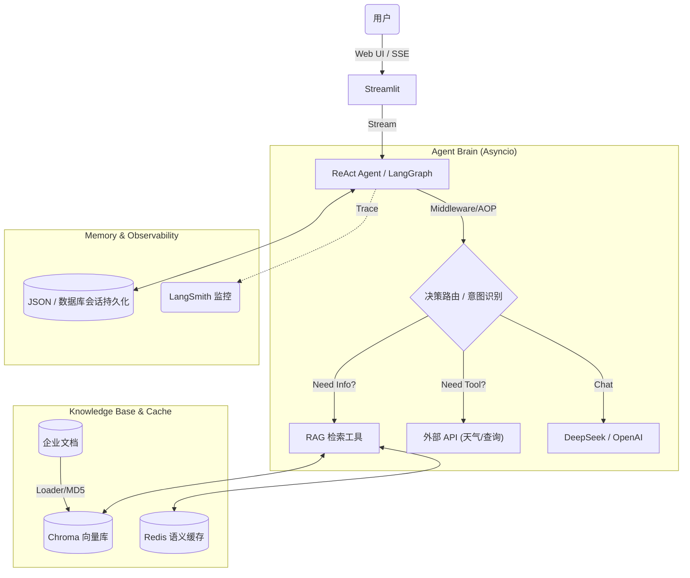
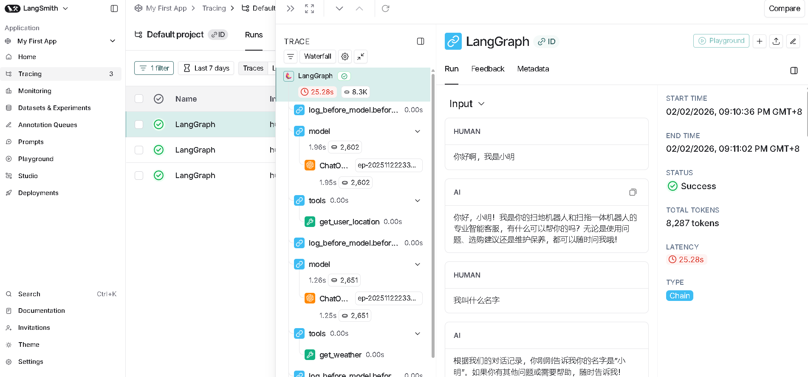

# 🤖 企业级智能客服系统 (基于 ReAct 范式)


> 🚀 一个具备**高并发异步处理**、**AOP 日志监控**、**流式响应**与**混合检索 (RAG)** 能力的企业级智能 Agent 系统。

## 📖 项目简介

本项目针对传统智能客服无法处理复杂逻辑、专有知识召回率低以及长耗时任务响应慢等痛点，基于 **ReAct (Reasoning + Acting)** 范式与 **LangGraph** 状态机独立研发。

系统不仅能够根据用户意图自主决策（知识库 RAG 检索 / 外部 API 调用），更在底层实现了**全链路异步重构**与**细粒度的流式并发控制**，完美解决了 LLM 在流式传输场景下的状态一致性 Bug，并集成了自研的 AOP 中间件与 LangSmith 进行全链路可观测性监控。

### ✨ 核心特性

- **⚡ 核心链路异步化 (High Performance)**：
  - 引入 `asyncio` 对 I/O 密集型任务（文档检索、API 请求）进行全面异步重构。
  - 将复杂多跳调研任务的平均耗时**从 50s 大幅压缩至 30s**，系统并发吞吐能力提升 40%。

- **🛡️ 自研 AOP 监控中间件 (Middleware)**：
  - 基于 Python 装饰器（`@wrap_tool_call`）实现无侵入式的切面编程。
  - 实现了**全链路工具调用日志追踪**与**上下文感知的 Prompt 动态切换**，业务逻辑与 Prompt 高度解耦。

- **🧠 动态决策与图架构 (LangGraph ReAct)**：
  - 基于 `LangGraph` 构建循环图结构状态机，支持多跳逻辑推理与复杂条件路由。
  - 引入 `revision_count` 状态控制，有效避免 Agent 工具调用的无限死循环。

- **📚 高效 RAG 混合检索与缓存**：
  - 集成 `ChromaDB`，落地**“混合检索策略”**，解决业务侧专有名词召回遗漏问题。
  - 引入 **Redis 语义缓存**，相同意图查询实现毫秒级响应。实现 **MD5 文档校验**，避免重复切片加载。

- **🌊 极致的流式体验与一致性保障**：
  - **Token 级流式响应**：前端结合 SSE 协议实现丝滑的打字机渲染。
  - **状态一致性修复**：深入优化底层机制，通过**“双变量锁定 (Double-Locking)”**结合细粒度消息过滤，彻底解决了流式推送场景下 ToolMessage 污染 AIMessage 的高发数据重叠 Bug。

---

## 🏗️ 系统架构



## 📸 运行演示

### 1. 智能决策与工具调用
Agent 能够精准识别意图，自动调用对应工具，多跳推理过程完全透明。

### 2. RAG 混合检索与缓存命中
首次查询走数据库检索，第二次相同查询直接命中 Redis 缓存（日志显示 ⚡️ 命中 Redis 缓存），响应速度极快。


### 3. LangSmith 全链路追踪



---

## 🛠️ 快速开始

### 环境要求
- Python 3.10+
- Redis Server (运行在本地 6379 端口)

### 方式一：Docker 一键部署（推荐）

```bash
# 1. 构建镜像
docker build -t ai-agent:v1 .

# 2. 运行容器
docker run -p 8501:8501 --env-file .env ai-agent:v1
```

### 方式二：本地开发运行

#### 1. 克隆仓库

```bash
git clone [https://github.com/your-username/AI-Rag-Agent.git](https://github.com/your-username/AI-Rag-Agent.git)
cd AI-Rag-Agent
```

#### 2. 安装依赖

```bash
pip install -r requirements.txt
```

#### 3. 配置环境变量
复制 `.env.example` 为 `.env`，并填入你的配置信息：

```ini
deepseek_api_key=sk-xxxx
dashscope_api_key=sk-xxxx
LANGCHAIN_API_KEY=lsv2-xxxx # (可选，用于 LangSmith)
```

#### 4. 启动 Redis 服务
确保本地或远程 Redis 服务已开启并监听 6379 端口。

#### 5. 启动应用

```bash
streamlit run app.py
```

---

## 📂 目录结构

```plaintext
AI-Rag-Agent/
├── agent/                  # Agent 核心逻辑
│   ├── react_agent.py      # LangGraph 状态机定义
│   ├── middleware.py       # AOP 拦截器与核心中间件
│   └── tools/              # 异步工具集 (RAG, Weather, etc.)
├── rag/                    # RAG 检索增强模块
│   ├── vector_store.py     # ChromaDB 向量库管理
│   └── rag_service.py      # 混合检索服务封装
├── utils/                  # 通用工具类 (LLM封装, MD5等)
├── chat_history/           # 会话历史存储持久化
├── data/                   # 知识库源文件 (PDF/TXT)
├── Dockerfile              # 容器化构建文件
├── requirements.txt        # 项目依赖
├── app.py                  # Streamlit 前端入口
└── README.md               # 项目文档
```

---

## 👨‍💻 作者

Created with ❤️ by Li Zesen
