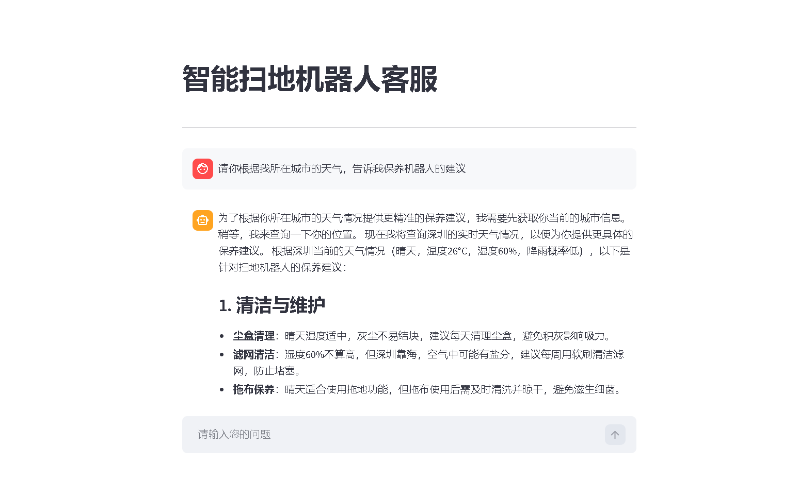

# 🤖 Enterprise Customer Service Agent (基于 ReAct 范式的企业级智能客服系统)


> 🚀 一个具备**长期记忆**、**流式响应**与**领域知识库检索 (RAG)** 能力的智能 Agent 系统。

## 📖 项目简介 (Introduction)

本项目不仅仅是一个简单的聊天机器人，而是一个基于 **ReAct (Reasoning + Acting)** 范式构建的自主智能体。

它采用了 **LangGraph** 构建状态机，能够根据用户意图自主决策：是直接回答、查询企业内部知识库（RAG），还是调用外部 API（如天气、订单查询）。项目解决了 LLM 在流式传输（Streaming）场景下的**状态一致性**与**记忆持久化**难题，并集成了 **LangSmith** 进行全链路可观测性监控。

### ✨ 核心特性 (Key Features)

* **🧠 动态决策大脑 (ReAct Agent)**：
    * 基于 `LangGraph` 构建循环图结构，支持多跳逻辑推理（Multi-hop Reasoning）。
    * 能够精准判断何时使用工具，何时进行闲聊。
* **📚 企业级 RAG 知识库**：
    * 集成 `ChromaDB` 向量数据库，支持 PDF/TXT 文档的自动切片与向量化。
    * 实现 **MD5 校验机制**，避免重复加载文档，提升启动效率。
* **⚡ 极致的用户体验**：
    * **全流式响应 (Streaming)**：实现 Token 级实时输出，拒绝等待。
    * **会话持久化**：基于 JSON 的轻量级 Session 存储，支持刷新页面后记忆不丢失。
    * **数据安全**：通过双变量锁定机制（Double-Locking），完美解决了流式输出中 ToolMessage 覆盖 AIMessage 的数据污染 Bug。
* **🐳 工程化交付**：
    * 支持 `Docker` 容器化部署，环境零依赖。
    * 集成 `LangSmith` 实现 Token 消耗监控与调用链追踪。

---

## 🏗️ 系统架构 (Architecture)

```mermaid
graph TD
    User("用户") -->|Web UI| Streamlit
    Streamlit -->|Stream| AgentCore["ReAct Agent / LangGraph"]
    
    subgraph "Agent Brain"
        AgentCore -->|Decision| Router{"决策路由"}
        Router -->|Need Info?| RAG["RAG 检索工具"]
        Router -->|Need Tool?| Tools["外部 API (天气/查询)"]
        Router -->|Chat| LLM["DeepSeek / OpenAI"]
    end
    
    subgraph "Knowledge Base"
        PDF[("企业文档")] -->|Loader| VectorDB[("Chroma 向量库")]
        RAG <--> VectorDB
    end
    
    subgraph "Memory & Logs"
        AgentCore <--> History[("JSON 会话历史")]
        AgentCore -.->|Trace| LangSmith("LangSmith 监控")
    end
 ```
## 📸 运行演示 (Screenshots)

1. 智能问答与 RAG 检索
 

2. LangSmith 全链路追踪
 

## 🛠️ 快速开始 (Quick Start)
方式一：Docker 一键部署（推荐）
```Bash
# 1. 构建镜像
docker build -t ai-agent:v1 .

# 2. 运行容器
docker run -p 8501:8501 --env-file .env ai-agent:v1
```
方式二：本地开发运行
1. 克隆仓库
```
Bash
git clone [https://github.com/your-username/AI-Rag-Agent.git](https://github.com/your-username/AI-Rag-Agent.git)
cd AI-Rag-Agent
```
2. 安装依赖
```
Bash
pip install -r requirements.txt
```
3. 配置环境变量 复制 .env.example 为 .env，并填入你的 API Key：
```Code snippet
deepseek_api_key=sk-xxxx
dashscope_api_key=sk-xxxx
LANGCHAIN_API_KEY=lsv2-xxxx (可选，用于 LangSmith)
```
4. 启动应用

```Bash
streamlit run app.py
```
## 📂 目录结构 (Directory Structure)
```Plaintext
AI-Rag-Agent/
├── agent/                  # Agent 核心逻辑
│   ├── react_agent.py      # LangGraph 状态机定义
│   └── tools/              # 工具集 (RAG, Weather, etc.)
├── rag/                    # RAG 检索增强模块
│   ├── vector_store.py     # 向量库管理 (ChromaDB)
│   └── rag_service.py      # RAG 服务封装
├── chat_history/           # 会话历史存储 (JSON)
├── data/                   # 知识库源文件 (PDF/TXT)
├── Dockerfile              # 容器化构建文件
├── requirements.txt        # 项目依赖
├── app.py                  # Streamlit 前端入口
└── README.md               # 项目文档
```
## 👨‍💻 作者

Created with ❤️ by Li Zesen